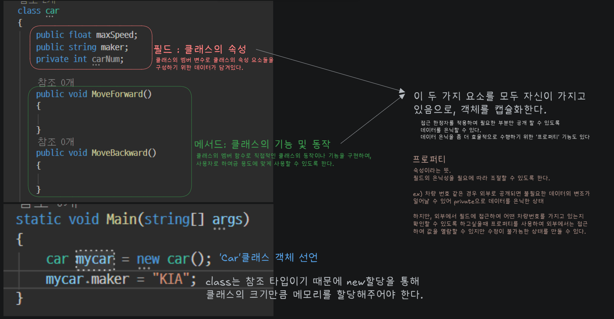

# 객체지향과 클래스
## 객체지향 프로그래밍[Object oriented programming(OOP)]
### 객체(Object)란?
객체 = 데이터 + 기능을 한 묶음으로 만든 것
- 현실 예시 (자동차)
    - 데이터 : 속도, 연료량, 전조등 켜짐 여부
    - 기능 : 앞으로 가기, 멈추기, 전조등 켜기

이걸 코드로 묶어 놓은 것이 객체 이다.

### 클래스(Class)란?
클래스 = 객체를 만들기 위한 설계도
- 클래스는 실제 물건이 아님
- 클래스로부터 객체를 여러 개 만들 수 있음

- 비유
    - 클래스 : 붕어빵 틀
    - 객체 : 실제 붕어빵
### 캡슐화(Encapsulation)
`프로그램 내에서 객체가 구동되기 위한 데이터(필드)와 동작(메서드)을 객체 자신이 가질 수 있는 성질`. 불필요한 데이터의 변질을 막기 위해 내부의 데이터와 동작을 감추고 `외부에는 필요한 부분만 노출(은닉)`하도록 할 수 있다.

`객체 내부는 숨기고, 필요한 것만 외부에 공개하는 것`
```csharp
class Car
{
   // 객체가 가지는 데이터
   float _moveSpeed;  // 이동 속도
   bool _onHeadLight; // 헤드라이트 점등 여부
   
   // 객체가 가지는 동작
   void MoveFront()  // 앞으로 이동
   {
   }
   void OnHeadLight() // 헤드라이트 점등
   {
   }
}
```
왜 필요한가?
- 데이터를 아무나 막 바꾸면 오류가 생긴다. 그래서 건드리지 않도록 하는 장치가 필요하다.
```csharp
class Car
{
private int speed; // 외부에서 직접 접근 불가


public void SetSpeed(int value)
{
speed = value;
}


public int GetSpeed()
{
return speed;
}
}
```
`private` : 외부 접근 금지

`public` : 외부에서 사용 가능
#### 프로퍼티
변수를 안전하게 다루기 위한 문법
```csharp
public int PlayerId
{
    get 
    { 
        return _playerId; 
    }
    set 
    { 
        _playerId = value; 
    }
}
```
- 겉으로 보면 변수처럼 보이지만 실제로는 함수(get/set)가 실행됨.
- 캡슐화를 더 편하게 쓰라고 만든 문법이다.

### 상속 (Inheritance)
하위 객체가 상속받은 상위 객체에서 정의된 (필드/메서드)을 재활용해서 반복적인 코드를 최소화하고 공유하는 속성과 기능에 간편하게 접근
```csharp
public class Vehicle
{
   protected float _moveSpeed;  // 이동 속도
   
   protected void MoveFront()  // 앞으로 이동
   {
   }
}

public class Car : Vehicle
{
   // 부모 객체인 Vehicle이 가진 필드와 메서드 재사용
}

public class Excavator : Vehicle
{
   // 부모 객체인 Vehicle이 가진 필드와 메서드 재사용
}
```

### 추상화 (Abstraction)
객체의 중요한 부분을 강조하기 위해 공통적인 속성과 기능을 추출하고 불필요한 세부 사항들은 제거, 객체의 가장 본질적이고 공통적인 부분만을 표현
```csharp
class Car
{
   // 자동차의 모든 요소를 구현하지 않고
   // 프로그램에서 필요로 하는 속성만 표현

   float _moveSpeed;  // 이동 속도
   bool _onHeadLight; // 헤드라이트 점등 여부

   void MoveFront()  // 앞으로 이동
   {
   }
   void OnHeadLight() // 헤드라이트 점등
   {
   }
}
```
### 다형성 (Polymorphism)
이름과 같이 객체의 속성이나 기능이 상황에 따라 여러 가지 형태를 가질 수 있는 성질 이 특성은 추후 프로그래밍을 배우며 지속적으로 다뤄질 객체지향에서 가장 중요한 특성 중 하나


## SOLID 원칙

### S : 단일 책임 원칙 (Single Responsibility Principle)

`클래스(객체)는 단 하나의 책임만 가져야 한다.` 즉, 하나의 클래스는 하나의 기능 담당하여 하나의 책임을 수행하는데 집중되도록 클래스를 개별적으로 설계하는 원칙

### O : 개방 폐쇄 원칙 (Open Closed Priciple)

`'확장에 열려있어야 하며, 수정에는 닫혀있어야 한다.'` 기능 추가시 기존의 코드를 수정하기보다 추가적인 코드를 작성해 기능을 추가할 수 있어야 한다는 원칙

### L : 리스코프 치환 원칙 (Listov Substitution Priciple)

`자식 객체는 언제나 부모 타입으로 교체될 수 있어야 한다.` 다형성의 특징을 이용하기 위해 상위 클래스 타입으로 객체를 선언하여 하위 클래스의 인스턴스를 받으면, 상태에서 부모의 메서드를 사용해도 프로그램이 동작해야 한다는 원칙

### I : 인터페이스 분리 원칙 (Interface Segregation Principle)

`하나의 큰 인터페이스보다 용도에 맞는 인터페이스를 잘게 분리해야 한다.` 프로그램의 유지보수에서 발생할 수 있는 인터페이스의 분리나 수정으로 인한 많은 양의 코드 수정을 막기 위해 불필요한 정보까지 가질 수 있는 하나의 거대한 인터페이스보다, 상황에 맞도록 소규모로 분리된 인터페이스를 사용할 수 있어야 한다는 원칙

### D : 의존 역전 원칙 (Dependency Inversion Principle)

`고수준의 모듈은 저수준 모듈의 구현에 의존해선 안 된다.` 객체가 객체를 참조하거나 의존 관계를 맺을 때, 세부구현된 객체보다 상위 객체를 참조함으로서, 세부구현된 클래스의 변화 발생 시에도 유연하게 동작할 수 있는 구조를 맺는 원칙


## 값 타입과 참조타입
### 메모리 구조
#### 스택영역(Stack)
- 함수와 관련된 지역 변수, 매개 변수 저장
```csharp
static void Main(string[] args)
{
    int a = 5;
    int b - 10;
    Foo(a, b);
}
static void Foo(int first, int second)
{
    int result = first + second;
    Console.WriteLine(result);
}// 함수 끝 -----------------> 블록 범위가 끝났을때 내용을 지운다.(a를 지움)
```

- 후입선출(LIFO) 방식으로 저장 및 삭제
    - 가장 최근에 저장한 데이터부터 순서대로 삭제된다.
- 상대적으로 작은 크기, 빠른속도


    메모리에서 일어나는 일

    출력 후 copy가 지워짐 -> Foo 함수 끝 -> 함수 내에서 썼던 매개변수 포함해서 할당되었던 변수들이 차례대로 지워짐 -> 메인함수도 끝남 -> 할당되었던게 역순으로 지워짐

#### 힙 영역
- 동적 메모리 저장
- `GabageCollector(GC)`에 의해 메모리 삭제
- 사용자에 의해 관리

#### 데이터 영역
- 전역 변수, 정적변수 등 저장
- 프로그램 시작 ~ 종료까지 저장 유지
#### 코드 영역
- 실행 가능한 프로그램 코드 저장
- 프로그램 시작 시점에 메모리에 로드

#### 메모리의 할당과 해제
메모리가 저장되고 삭제되는 과정
- 할당 : 사용을 위해 필요한 크기만큼의 비어있는 메모리를 측정하여 사용
- 해제 : 할당된 메모리를 다시 사용할 수 있도록 메모리에 있는 내용을 비워해는 작업

만약, 사용된 메모리가 해제되지 않고 남아 있다면 매우 불필요하게 공간을 차지하게 될 것이고 메모리 누수가 발생될것이다.
#### C#의 형식
- 값 타입

    변수의 실제 데이터값을 저장한다.

    변수가 값을 가지고 있으며, 이 값은 직접적으로 스택 메모리에 저장된다.
    - 메모리에 실제 값을 저장
    - 값이 전달될 때, 실제 데이터가 복사되어 전달됨.
    - 구조체, 기본 자료형(int,float ...)

- 참조 타입
    - 데이터가 힙 메모리에 저장되고, 변수에는 데이터가 저장된 힙 메모리의 주소를 저장
    - 값이 전달될 때, 변수에 저장된 힙 메모리의 주소가 복사됨.
    - 클래스, 배열 등 ...
    
    여러 변수가 동일한 데이터를 가리킬 수 있고, 변수 간에는 데이터가 공유 된다. 원활한 프로그래밍을 위해서는, 각 타입의 메모리 할당 방식을 고려하여 어떻게 하면 효과적인 방식으로 메모리를 사용할지 생각해야한다.


## 클래스 사용해보기
```csharp
static void Main(string[] args)
{
    car mycar;
    mycar.maker = "KIA";
}
class car
{
    public float maxspeed;
    public string maker;
    private int carNum;
}
```

```csharp
class car
{
    public float maxSpeed;
    public string maker;
    private int carNum;

    public int CarNum
    {
        get {return carNum;}
        private set {carNum = value;}
    }
    public void MoveForward()
    {

    }
    public void MoveBackward()
    {

    }

    static void Main(string[] args)
    {
        car mycar = new car();
        mycar.maker = "KIA";

        mycar.CarNum = 1234; //은닉을 했기 때문에 오류를 뱉을것이다.
    }
}
```

## 클래스 생성자
생성자

인스턴스가 생성될 때 호출되는 (특수한)함수
- 데이터 초기화할 때
- 다른 객체와 참조할 준비가 됐는지 확인할 때

구조체에서 생성자
```csharp
public Player(int health)
{
    Console.WriteLine("생성자 호출");
}
```
